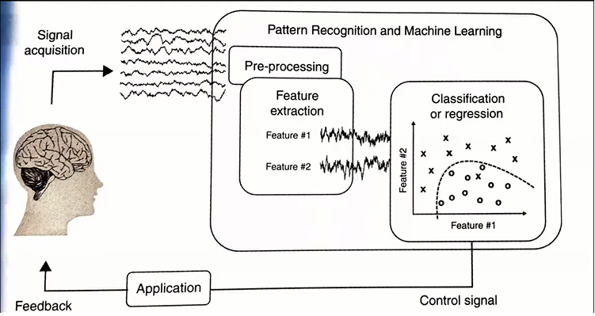

# EEG_Classification

## Current Stage
- Collected dataset that consist of raw signal values from muse headset in dataset/raw_dataset/
- Converted raw dataset to generate training data in dataset/training_dataset/ using EEG_feature_extraction.py & EEG_generate_training_matrix.py
- The models in saved_models/ are trained with different hyperparameters settings, and best cases are saved.
- However, these models all have a limitation in not being able to make accurate predictions when the signal values become stabilized.

## Future Goals
- Collect new dataset from directions in muse_setup
- Now the dataset will be stabilized, also with one more state added (Stationary state)
- Refer to current model hyperparameter settings and update model accordingly to be able to classify between 4 states (uncomment some code that I've made)
- Update real-time_classification.py file accordingly (uncomment some code that I've made) to also take the change of model in effect.

## Steps to execute the draft program
1. Fork this repository and install packages listed in requirements.txt
2. Run "real-time_classification.py" to open up BlueMuse, it will generate a runtime error the first time
3. When BlueMuse GUI opens up, find the muse device and click "Start Stream"
4. Rerun the program to start the classification (may be helpful to open up another window and view the real-time signal value graphs with "muselsl view")
5. Complete four different tasks(states) in mind using imagination as such, use appropriate eye movements as such to help better the prediction results

## This work has applied approaches found here:
- [Paper](https://www.researchgate.net/publication/328615252_A_Study_on_Mental_State_Classification_using_EEG-based_Brain-Machine_Interface)
- [Github](https://github.com/jordan-bird/eeg-feature-generation)
